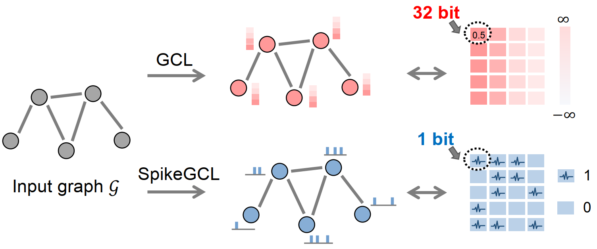
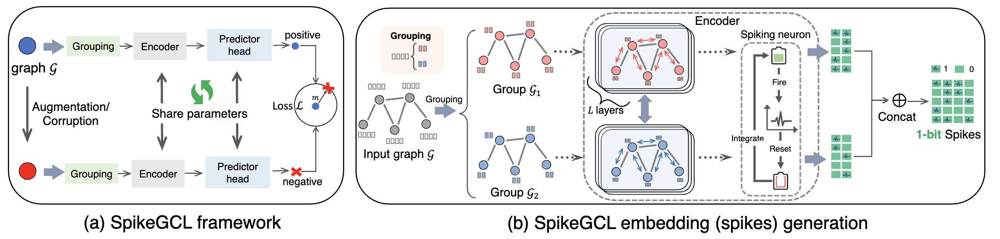
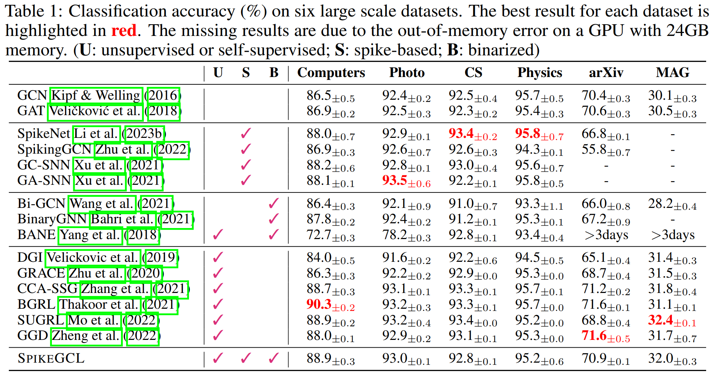
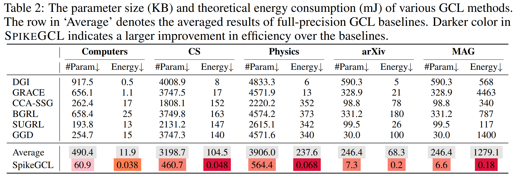

<div align="center">
<h1>0️⃣1️⃣ SpikeGCL (Spiking Graph Contrastive Learning)</h1>
<h3>A Graph is Worth 1-bit Spikes: When Graph Contrastive Learning Meets Spiking Neural Networks</h3>

Jintang Li<sup>1</sup>, Huizhe Zhang<sup>1</sup>, Ruofan Wu<sup>2</sup>, Zulun Zhu<sup>3</sup>, Baokun Wang<sup>2</sup>, Changhua Meng<sup>2</sup>, Zibin Zheng<sup>1</sup>, Liang Chen<sup>1</sup>

<sup>1</sup>Sun Yat-sen University, <sup>2</sup>Ant Group, <sup>3</sup>Nanyang Technological University
 

arXiv ([arXiv:2305.19306](https://arxiv.org/abs/2305.19306)),
OpenReview ([ICLR'24](https://openreview.net/forum?id=LnLySuf1vp))

</div>

<div align="center">
  
</div>


## Environments

> [!NOTE]
> Higher versions should be also compatible.

+ numpy == 1.23.3
+ torch == 1.8+cu111
+ torch-cluster == 1.6.1
+ torch_geometric == 2.3.0
+ torch-scatter == 2.1.1
+ torch-sparse == 0.6.17
+ CUDA 11.1
+ cuDNN 8.0.5

## Model and Results

SpikeGCL adopts a simple GCL architecture and is comprised of a set of peer GNN encoders and a spiking neuron.

<div align="center">
  
</div>

The following tables present the performance & efficiency results for standard node classification tasks on several graph benchmark datasets.
<div align="center">
  
  
</div>

## Reproduction

+ Cora
```
python main.py --dataset Cora --threshold 5e-4 --outs 2 --T 64 --bn --epochs 5
```
+ Citeseer
```
python main.py --dataset Citeseer --threshold 5e-3 --T 32 --bn --epochs 5
```
+ Pubmed
```
python main.py --dataset Pubmed --threshold 5e-2 --bn --T 32 --epochs 50
```
+ Computers
```
python main.py --dataset Computers --threshold 5e-2 --outs 32 --bn --T 25
```
+ Photo 
```
python main.py --dataset Photo --threshold 5e-2 --T 15 --bn --outs 8 --epochs 50
```
+ CS
```
python main.py --dataset CS --threshold 5e-1 --outs 32 --T 60 --dropout 0. --bn
```
+ Physics 
```
python main.py --dataset Physics --T 25 --outs 16 --margin 1 --threshold 5e-2 --bn
```
+ Ogbn-arXiv
```
python main.py --dataset ogbn-arxiv --T 30 --outs 1 --threshold 5e-2 --no_shuffle --bn --dropout 0.
```
+ Ogbn-MAG
```
python main.py --dataset ogbn-mag --T 8 --outs 8 --hids 64 --threshold 5e-3 --no_shuffle --bn
```

## Citation
If you find this repository useful in your research, please consider giving a star ⭐ and a citation

```bibtex
@inproceedings{spikegcl,
    title={A Graph is Worth 1-bit Spikes: When Graph Contrastive Learning Meets Spiking Neural Networks},
    author={Jintang Li and Huizhe Zhang and Ruofan Wu and Zulun Zhu and Baokun Wang and Changhua Meng and Zibin Zheng and Liang Chen},
    booktitle={ICLR},
    year={2024},
    url={https://openreview.net/forum?id=LnLySuf1vp}
}
```
